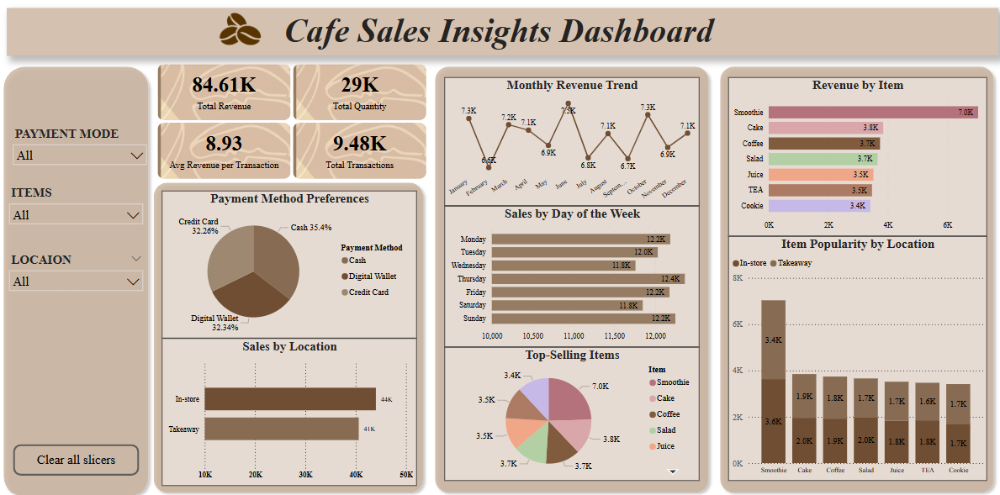

# Cafe Sales Analysis Dashboard

## Description:
This Power BI project presents an in-depth visual analysis of sales performance data from a fictional cafe. The dashboard was designed to deliver key business insights across several dimensions including sales trends, customer behavior, and product performance. With interactive visualizations and dynamic filtering capabilities, this dashboard enables users to quickly identify high-performing products, understand customer preferences, and track revenue growth over time.

The goal of this project is to demonstrate how businesses in the food and beverage industry can leverage data analytics and visualization tools to make informed decisions, optimize operations, and improve customer satisfaction. By breaking down complex data into easy-to-understand visuals, this dashboard supports better strategic planning and performance monitoring.

## Key Features:

### 1. Dashboard Layout and Design:
- A professional and organized layout with a clean, coffee-themed aesthetic.
- An easy-to-navigate interface with dynamic filtering options.

### 2. Key Performance Indicators (KPIs):
Displayed in a card visual
- Total Revenue
- Total Transactions
- Average Revenue per Transaction
- Total Quantity Sold

### 3. Sales Trends Analysis:
- Monthly Revenue Trend: Line chart to track revenue variation across months.
- Sales by Day of the Week: Bar chart to identify peak sales days.

### 4. Product Performance:
- Top-Selling Items: Pie chart visualizing item popularity based on quantity sold.
- Revenue by Item: Bar chart displaying revenue generated by each product.

### 5. Customer Behavior Insights:
- Payment Method Preferences: Pie chart showing the distribution of payment methods (Cash, Credit Card, Digital Wallet).
- Sales by Location: Clustered bar chart comparing revenue from "In-store" and "Takeaway" sales.

### 6. Product Popularity by Location:
- Stacked Column Chart: Visualizing how popular each item is in different locations.

### 7. Dynamic Filtering:
- Category Filter: Allows users to filter by item type.
- Location Payment Method Filter: Allows users to filter by location type.
- Payment Method Filter: Allows users to filter by payment type
  
## Technologies Used:
**Data Cleaning**: SQL (MySQL). 
**Data Visualization**: PowerBI

## Data Source:
- **Cleaned Data**:[`Clean Dataset`](./clean_cafe_sales.csv). You can see the data cleaning process [`here`](https://github.com/SaiAbhignaTalla/Cafe_Sales_Data_Cleaning_sql).
- **Raw Data**: The dataset was obtained from Kaggle. You can find it [`here`](https://www.kaggle.com/datasets/ahmedmohamed2003/cafe-sales-dirty-data-for-cleaning-training).

## Dashboard Preview:

